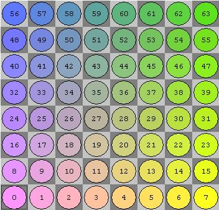

# Chess Engine

This is the chess engine used internally.

All pieces are stored as bitboards.

Directions:

noWe         nort         noEa
        +7    +8    +9
            \  |  / 
west    -1 <-  0 -> +1    east
            /  |  \
        -9    -8    -7
soWe         sout         soEa

